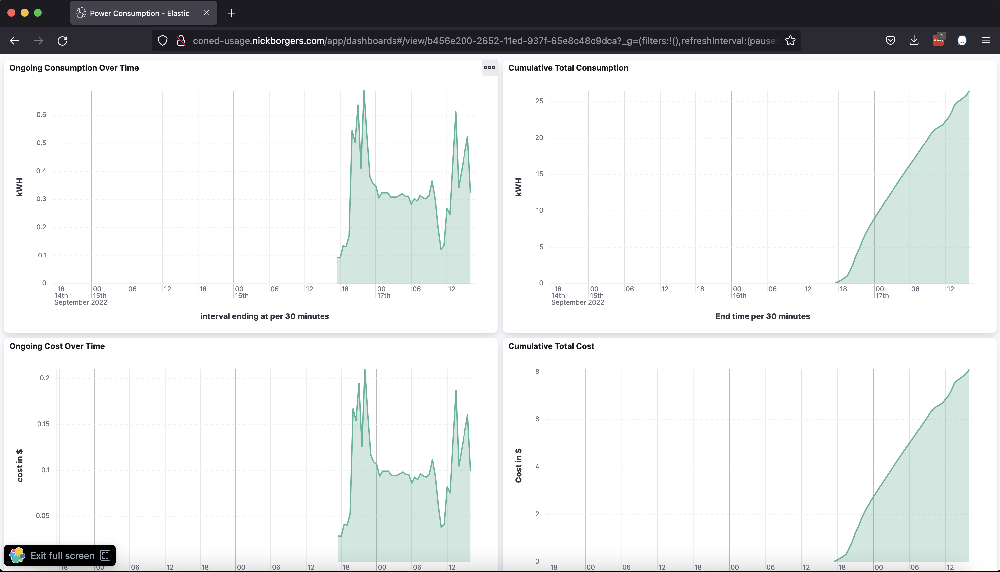

# ConEd Usage Visualizer
I don't like how ConEd represents electricity usage data, and want something that appeals to me visually.

I've used The Elastic Stack for this in the past and have containerized it before, so that seems easy.



## Configuration
You must [follow the directions published for the underlying Python package for interacting with ConEd's website](https://github.com/bvlaicu/coned).

Then, you can populate a `./.credentials.env` file like:
```
LOGIN_EMAIL_ADDRESS=whoever@example.com
LOGIN_PASSWORD=password
LOGIN_TOTP_SECRET=JBSWY3DPEHPK3PXP
ACCOUNT_UUID=b6a7954a-f9a0-46bf-92a5-2ccc8e50a755
METER_NUMBER=123456890
COST_PER_KWH=0.30
```
This will feed data to the ConEd Collector container.

## Get this running
Dependencies:
1. Aforementioned setup for ConEd interaction
1. Docker Compose; I'm actually running this with Podman + their support for interoperability with Docker Compose
1. Make, if you want any semblance of security

Recommended way to start this up is to run:
```
make
```
That will generate unique password for Elasticsearch and Kibana.

Note: even in this configuration there will be a user `viewer` and password `password`; but it lacks privilege to do anything destructive.

You technically can just run `docker-compose up` but it will use the passwords that have been comitted into the public repo. Whether or not this really matters depends on the level of network exposure for the endpoints.

